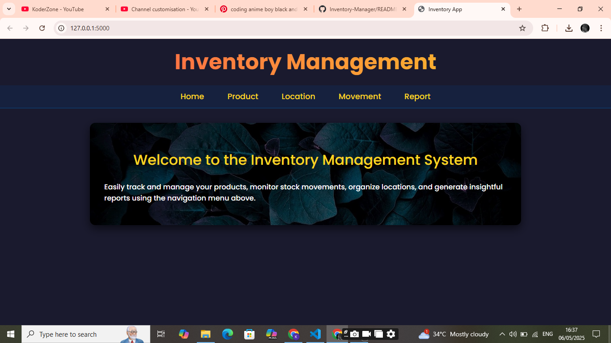
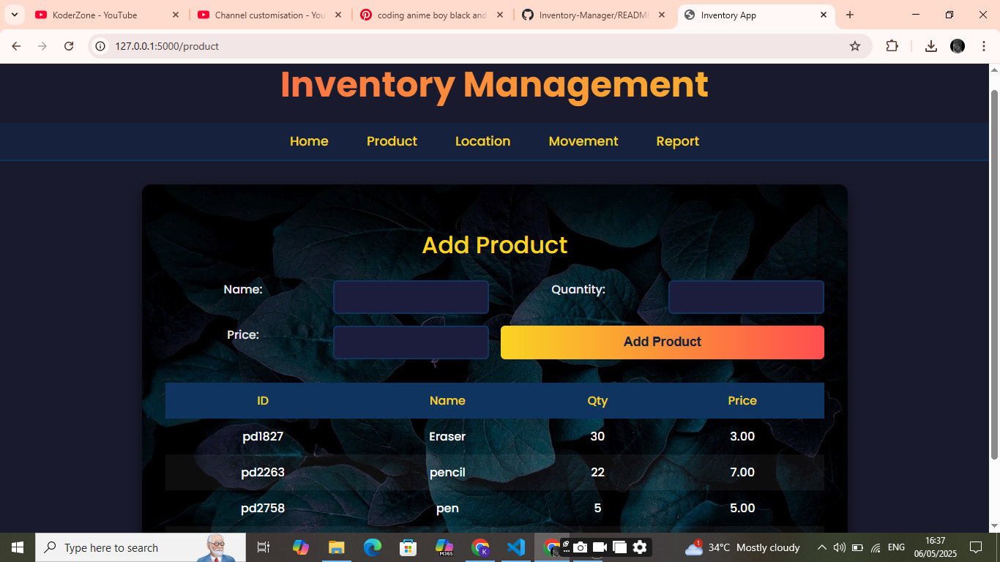
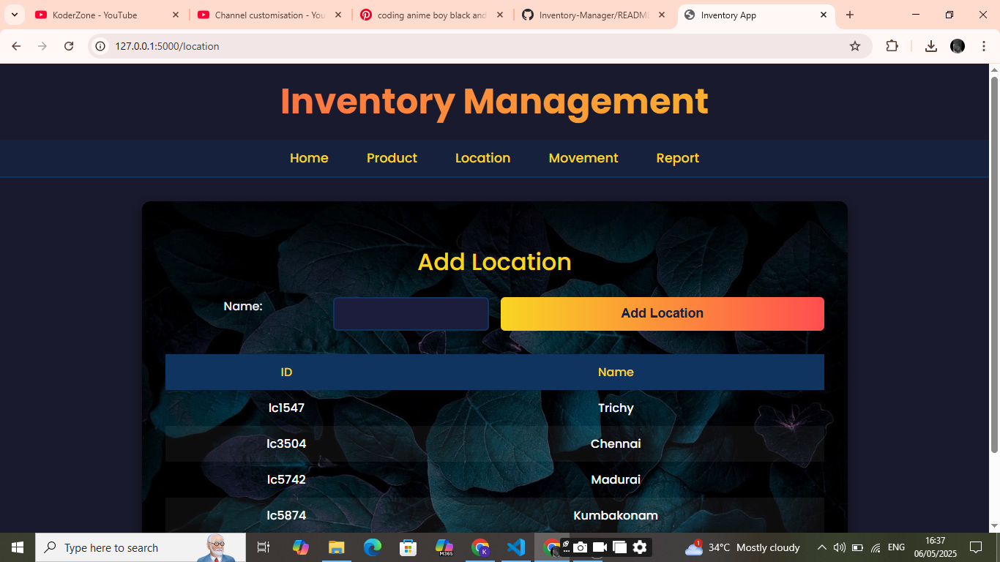
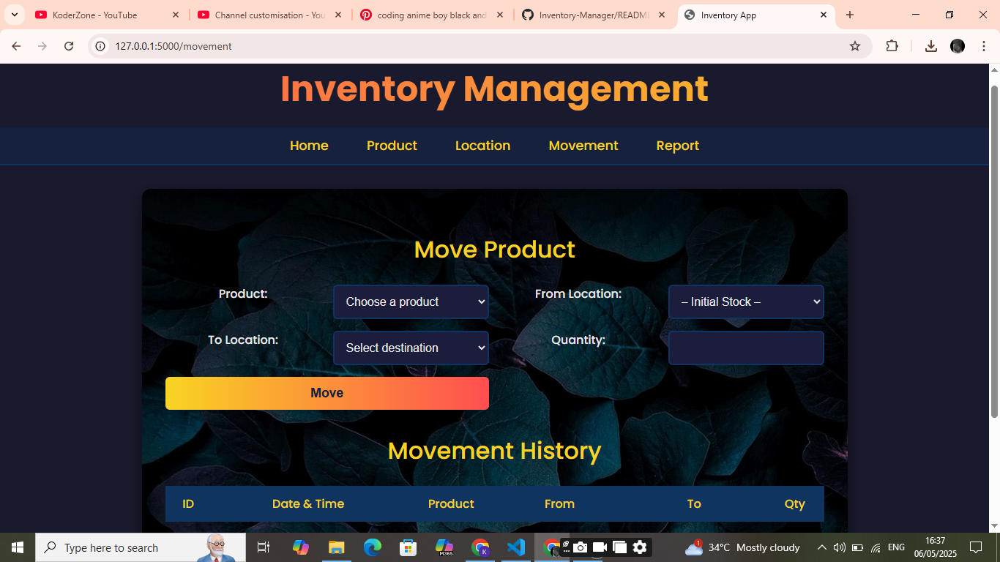
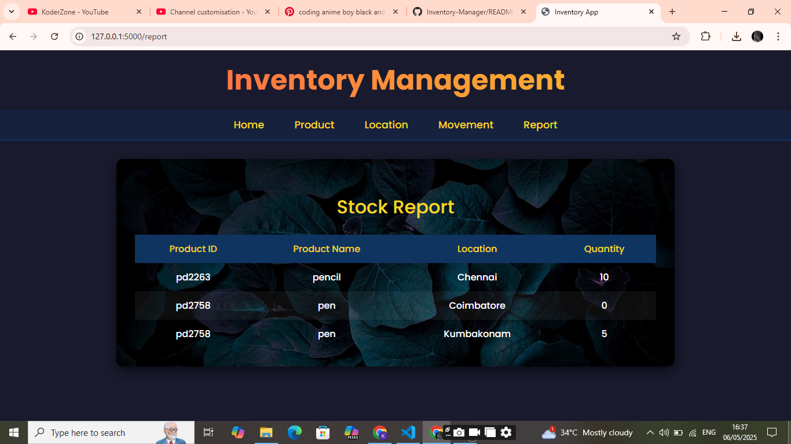

# 📦 Inventory Management System using Flask

A web-based Inventory Management System built with **Python Flask** and **MySQL**.  
This system helps track products, manage storage locations, and handle product movement between locations efficiently.

---

## 🚀 Project Overview

This app provides core inventory features:

- Add **products**
- Add **locations**
- Move products from one location to another
- View real-time **inventory reports**

---

## 🧑‍💻 Tech Stack

- **Backend**: Python (Flask)
- **Frontend**: HTML, CSS (Bootstrap)
- **Database**: MySQL
- **Templating**: Jinja2

---

## 🗃️ Key Features

- 📌 Add new **Products**
- 🌍 Add new **Locations**
- 🔄 Move products between locations
- 📊 View Inventory Reports (product quantities by location)

---

## 🌐 Deployment

This project was **previously hosted on AWS S3 (Static Website Hosting)** for demo purposes.  
Hosting is currently **terminated**, but I'm experienced in **cloud deployments** and can redeploy using AWS EC2 or similar platforms.

---

## 🎥 Project Demo

📺 Watch the full video demo on YouTube:  
👉 [Click here to watch](https://youtu.be/bK1_5VKw1yc?si=KrIFF8z4b1_LHlit)

---

## 📸 Screenshots

| Home Page | Add Product | Add Location |
|-----------|-------------|--------------|
|  |  |  |

| Move Product | Inventory Report |
|--------------|------------------|
|  |  |

---

## 🛠️ How to Run Locally

```bash
git clone https://github.com/your-username/inventory-flask.git
cd inventory-flask
python -m venv venv
source venv/bin/activate  # or venv\Scripts\activate on Windows
pip install -r requirements.txt
python app.py

---

💾 Set up MySQL Database
Create a new MySQL database (e.g., inventory_db)

Update your config.py with DB credentials

Run app.py to start the Flask server

bash
Copy code
python app.py
Visit the app at: http://localhost:5000

---

📌 Future Enhancements
1. Add/Edit/Delete features

2. User authentication

3. Responsive dashboard

4. Deploy on cloud permanently

🙋‍♂️ About Me
I’m Kishore, a B.Tech IT student passionate about full-stack development and cloud technologies.

#FlaskProject #PythonWebApp #InventorySystem #Karpagam2025 #FullStack #CloudReady
